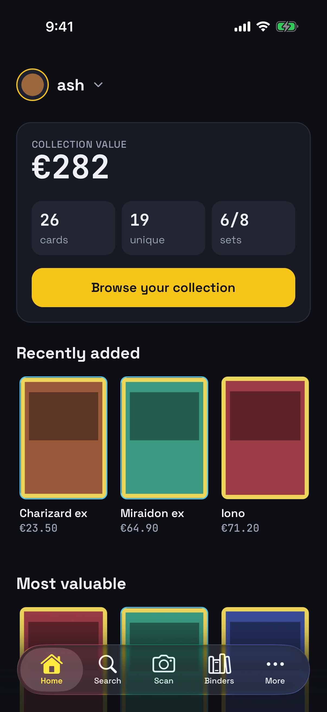
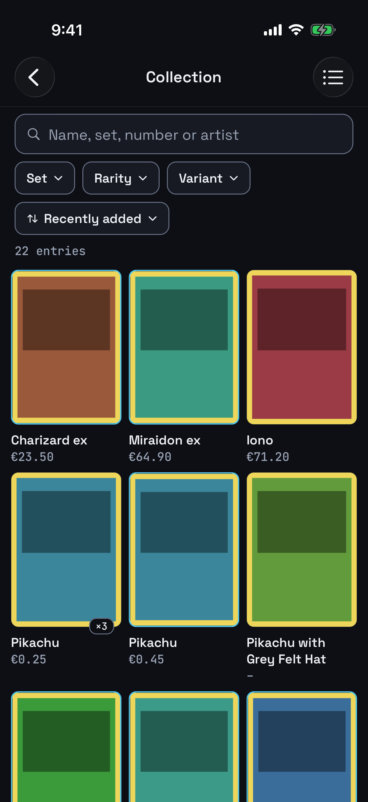
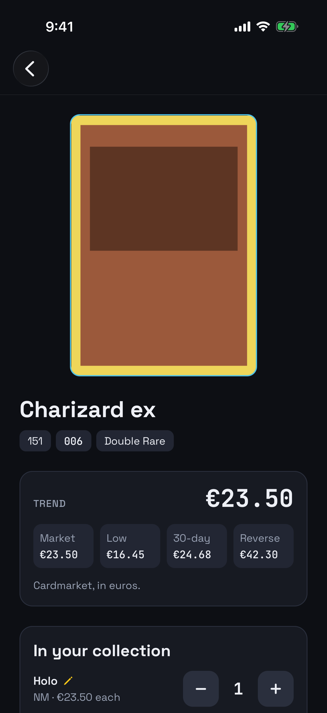
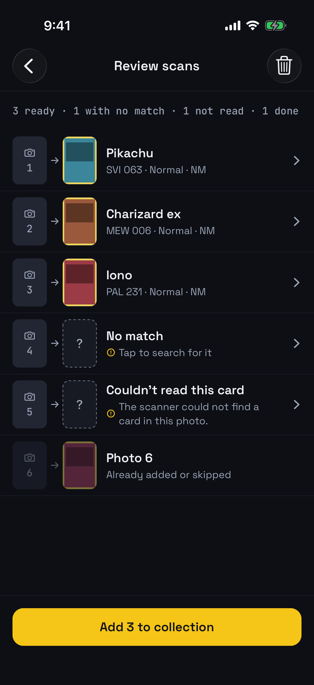
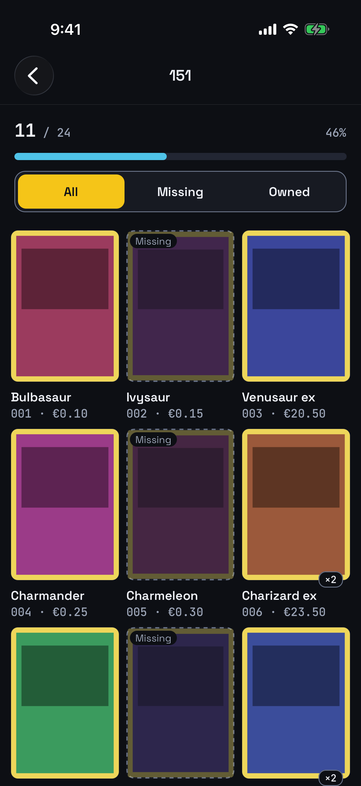
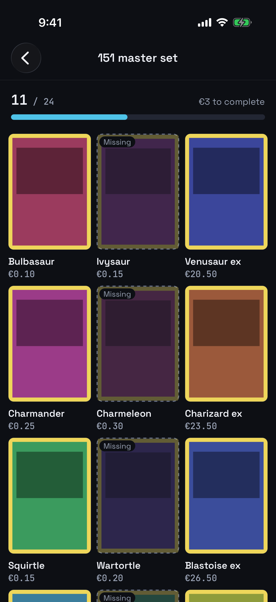
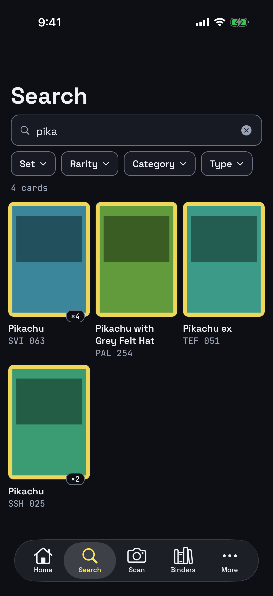
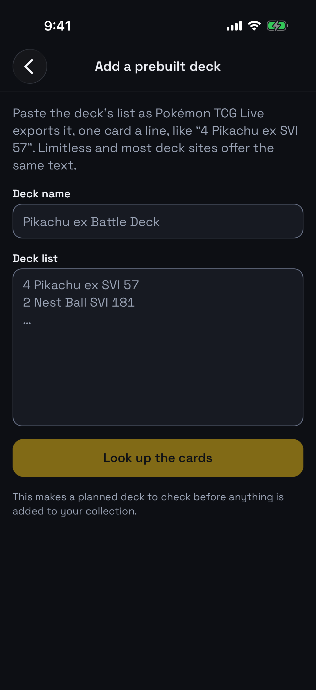
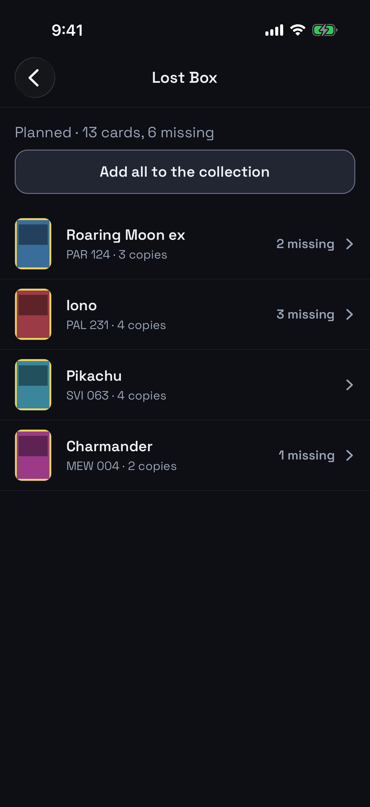
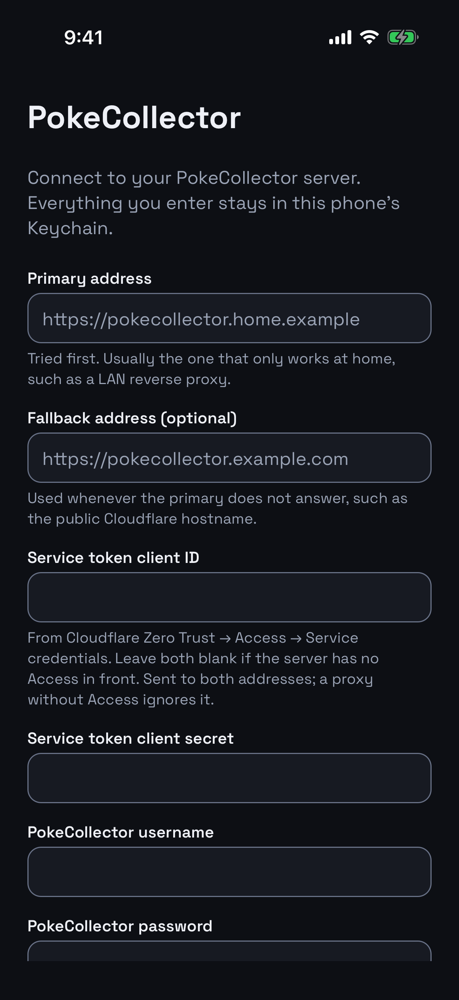

# PokeCollector for iPhone

Your self-hosted [PokeCollector](https://github.com/Git-Romer/pokecollector)
collection, in your pocket. Scan cards with the camera, check what they're
worth, tick off sets and binders, and add a whole prebuilt deck in one go. It
works on home Wi-Fi and away from it.

<p align="center">
  
  
  
  
</p>

> [!WARNING]
> **This code is unapologetically vibe coded.** It was written largely by an AI
> coding assistant, for one person's own collection, and reviewed about as
> carefully as that suggests. It is provided **as is, with no warranties or
> guarantees of any kind**: not that it works, not that it is secure, not that
> it will not eat your collection. No support is offered and none should be
> expected. If you point it at your own server, you do so entirely at your own
> risk.

It is not affiliated with PokeCollector, The Pokémon Company, Nintendo, Game
Freak or Creatures. It talks to PokeCollector's own API, unmodified, so
everything you do in the app shows up in the web UI and the other way round.

## Features

### Scan cards with the camera

Line a card up in the guide and the app sends the photo to your server's card
scanner, then shows the best matches. Pick one, choose the variant, condition
and quantity, and it's in your collection, usually in two taps.

- **Auto-capture.** Turn on **Auto** and the photo takes itself once the
  card's edges hold still. It only takes a card once, so you can keep feeding
  cards under the camera.
- **Batch mode.** Photograph a stack, then send them all as one job. Cards
  that have been read can be reviewed while the rest are still being read, and
  **Add all** adds them at a pace the server can handle.
- **From your photo library.** Already took the photos? Pick them from the
  library and they go off as a batch.
- **Come back later.** Batches are kept on the server. Leave one half-reviewed
  and pick it up from the Scan tab, or from the web UI.

### Your collection, at a glance

Home shows what the collection is worth, how many cards and sets you have,
and what you added recently. The collection itself is a grid or a list, with
search by name, set, number or artist, filters for set, rarity and variant,
and sorting by value, date added, name or set number. Search and filtering run
on the phone, so they're instant.

### Card detail and prices

A large image, the set, number and rarity, and Cardmarket prices (trend,
market, low, 30-day average and reverse holo). Change the quantity of each
copy you own with + and −, change its variant or condition, or add the card to
the collection, your wishlist or a binder.

Some cards, such as McDonald's promos and trainer kit cards, have no picture
in the catalogue. For a card like that you own, take a photo of your copy or
pick one from your library. It shows wherever the card does, and only you see
it.

### Sets, binders and the wishlist

<p align="center">
  
  
  
</p>

- **Sets** show how far you've got through each set. Each one opens a
  checklist of every card, where you can show all, only the missing ones, or
  only the ones you own, and search by name or number.
- **Binders** show what's in them, what's missing and what completing them
  would cost.
- **Wishlist** lists the cards you want with their prices. Swipe left or hold
  a card to remove it.
- **Search** covers the whole card catalogue, not only your collection, and
  shows how many of each card you already own. Filter it by set, rarity,
  category and type.

### Add a prebuilt deck in one go

<p align="center">
  
  
</p>

Paste a deck list the way Pokémon TCG Live exports it (`4 Pikachu ex SVI 57`).
Limitless and most deck sites offer the same text. The app looks up every
card and shows you the deck before anything changes. Then you can add every
card to the collection and make it a Real Deck, keep it as a planned deck, or
throw it away.

### More than one collector

Several accounts on the same server, such as everyone in a household, each
with their own collection. Tap the name on Home to switch. Each account's
data is cached separately, so switching is instant, and the active account's
name is always on screen, so you don't add a card to the wrong collection.

### Home and away

Give the app two addresses: one for home (a LAN name, say) and one for
everywhere else (a public hostname). It uses whichever one answers, and
checks again when the network changes. Screens you've already opened keep
their last data when you're offline. Edits need a connection, and the app
tells you when you haven't got one.

### Built to be easy to use

There's a dark "Night holo" theme, and every screen is checked for colour
contrast. Text sizes go up to the largest accessibility size, every control
works with VoiceOver, tap targets are big enough to hit, and haptics confirm
your edits. CI runs Apple's accessibility audit on every screen, at the
default text size and the largest one.

## What you need

- **A PokeCollector server** you run yourself, reachable over **https**. For
  scanning, a scanner provider has to be set up for your account in
  PokeCollector's web UI (Settings → Scanner).
- **Whatever is in front of it**, if anything. That can be nothing (a server
  on your network, or reached over a VPN such as Tailscale),
  [Cloudflare Access](https://developers.cloudflare.com/cloudflare-one/policies/access/)
  with a service token for the app, or another reverse proxy that wants
  headers of its own.
- **An iPhone**, a free Apple ID, and **[SideStore](https://sidestore.io)**
  (or AltStore). You don't need a Mac or a paid developer account: the app is
  built in GitHub Actions.

## Install

The app isn't on the App Store. Each
[release](https://github.com/jrmcdonald/pokecollector-app/releases) has an IPA
built by GitHub Actions, and a source that SideStore installs and updates it
from.

1. **Set up SideStore** by following
   [its install guide](https://docs.sidestore.io). It needs a computer once,
   to install SideStore and pair the phone. After that, SideStore signs and
   refreshes apps on the phone itself, without AltServer.
2. **Add the source.** In SideStore, Sources → **+**, and enter:

   ```text
   https://github.com/jrmcdonald/pokecollector-app/releases/latest/download/source.json
   ```

3. **Install PokeCollector** from the source. New releases show up as updates
   in SideStore.
4. **Keep it refreshed.** Apps signed with a free Apple ID expire after 7
   days. SideStore renews them: open it now and then, or let its background
   refresh do it.

AltStore reads the same source. With AltStore Classic, AltServer has to run
on a computer on the same network to install and refresh. Or download the
IPA from a release and open it in either one.

A free Apple ID can have three sideloaded apps at once, SideStore included,
so there's room for the app and its development build.

## First launch



The app asks how to reach your server and who you are. Nothing about your
server is built into the app or committed here.

| Field                  | Example                              | Notes                                                                       |
| ---------------------- | ------------------------------------ | --------------------------------------------------------------------------- |
| Primary address        | `https://pokecollector.home.example` | Tried first. Usually a LAN-only name, used at home                          |
| Fallback address       | `https://pokecollector.example.com`  | Optional. Used when the primary doesn't answer, such as a public hostname   |
| In front of the server | None, Cloudflare or Headers          | A service token's ID and secret, or up to five custom headers, sent to both |
| Username and password  |                                      | Your PokeCollector account                                                  |

**Connect** checks the server and the proxy first, then the login, so if
something's wrong it tells you which. Everything stays in
the phone's Keychain.

With two addresses, the primary gets three seconds to answer before the
fallback is used. Both must reach the same PokeCollector server.

<br clear="right">

## Using the app

The tab bar has **Home**, **Search**, **Scan**, **Binders** and **More**.
**More** holds the wishlist, sets, decks and settings.

| To…                           | Do this                                                                        |
| ----------------------------- | ------------------------------------------------------------------------------ |
| Browse your collection        | Home → **Browse your collection**. The top-right button switches grid and list |
| Add a card you're holding     | **Scan**, line it up, tap the shutter (or turn on **Auto**), pick the match    |
| Add a stack of cards          | **Scan** → **Batch**, photograph each card, then send the batch and review it  |
| Add a card you don't have yet | **Search**, open the card, then **Add to collection**                          |
| Change how many you own       | Open the card and use + and − on that copy                                     |
| See what's missing from a set | More → **Sets**, open the set, then **Missing**                                |
| Add a prebuilt deck           | More → **Decks** → **Add a prebuilt deck**, paste the list                     |
| Switch collector              | Tap the account name on Home, or More → **Settings** → Accounts                |
| Add another collector         | More → **Settings** → **Add an account** (same server, their own login)        |
| Change the server or login    | More → **Settings** → **Server and login**                                     |

**Go easy on the server.** PokeCollector allows 60 requests a minute from
each IP address, and every phone and browser behind the same tunnel or router
shares that IP. The app caches heavily and paces bulk adds to stay within the
limit. If it says PokeCollector is rate limiting requests, wait a moment.

## Development

The app is [Expo](https://expo.dev) SDK 57 (React Native, TypeScript),
using Expo Router, TanStack Query, zod and FlashList. All server access goes
through `src/api`, typed from PokeCollector's OpenAPI spec in `openapi/`.

**The dev loop.** Run the **iOS build** workflow by hand (Actions → iOS build
→ Run workflow) with `development`, download the `PokeCollector-development`
artifact, and install the IPA with SideStore as **PokeCollector Dev**,
alongside the normal app. Then, on your computer:

```bash
npm ci
npm start        # Metro for the dev client
```

Open PokeCollector Dev on the phone and connect to Metro over the LAN (allow
port 8081 through the firewall). JavaScript changes hot-reload. You only need
a new build when native code changes: a new native dependency, an SDK bump or
`app.config.ts`.

**Checks**, which CI runs on every push:

```bash
npm run lint
npm run typecheck
npm run format:check
npm test
```

CI also regenerates `src/api/generated.ts` from the spec (`npm run
generate:api`) and fails if it changed. The **Simulator** workflow walks the
release build through every screen against a fake server with made-up data,
runs Apple's accessibility audit on each screen, and compares screenshots with
the approved ones in [`e2e/screenshots/`](e2e/screenshots). Those are the
screenshots in this README, so they stay current. See
[`e2e/README.md`](e2e/README.md).

**Releases** are made by
[release-please](https://github.com/googleapis/release-please) from
[Conventional Commits](https://www.conventionalcommits.org): `feat:` raises
the minor version, `fix:` the patch, and `feat!:` or a `BREAKING CHANGE:`
footer the major. It keeps a "chore: release x.y.z" pull request open with the
next changelog entry. Merging it tags the commit and publishes the release,
and the **Release** workflow builds that commit and attaches the IPA and the
SideStore source (`scripts/release/`). The build number is the commit count.

The card art in the screenshots is a placeholder. The fake server makes up
its cards, and real artwork belongs to Nintendo, Game Freak and The Pokémon
Company.

### Docs

- [`docs/PLAN.md`](docs/PLAN.md): the build plan and where it has got to
- [`docs/DECISIONS.md`](docs/DECISIONS.md): why things are the way they are
- [`docs/API.md`](docs/API.md): which of PokeCollector's endpoints the app
  uses, and how
- [`CLAUDE.md`](CLAUDE.md): commands, layout and conventions

## License

Released into the public domain under [The Unlicense](LICENSE). Do what you
like with it; see the warning above for what that is worth.

One exception: `openapi/` and `src/api/generated.ts` are generated from
PokeCollector's own source, which is licensed under the
[AGPL-3.0](https://github.com/Git-Romer/pokecollector/blob/main/LICENSE). They
describe its API rather than implement it, but they are derived from that
source and are not the author's to dedicate to the public domain.
